  
  <h1>CodexHalo</h1>
  
Your Codex limits, quietly in sight.

  

    <a href="https://github.com/Mike-Animal-Counseling/CodexHalo/releases/download/v1.0.0/CodexHalo_1.0.0_x64-setup.exe"><strong>Download</strong></a>
  

   
  

## Simple by design

CodexHalo is a lightweight Windows companion for Codex. It stays out of the way
as a small floating Halo and expands into a focused usage view whenever you want
more detail.

- Track your Codex quota windows and reset times.
- See today's token usage, model breakdown, and estimated API-equivalent value.
- Drag it anywhere, snap it to the edge of your screen, or restore it from the
  system tray.

Works with Codex in VS Code and the official Codex CLI.

## Install

Download the latest Windows installer, open CodexHalo, and enable Codex access
when you're ready.

**Windows 10/11 (x64)**

CodexHalo v1.0.0 is currently unsigned, so Windows SmartScreen may show a
warning when you first run the installer.

**SHA-256**

`5911FDA4B59DD54F1159A8EF03E266FB40B19F411A1267CD2C57F2A640415BFD`

## Private by default

CodexHalo is local-first. Codex access is off by default and nothing reads your
local Codex data until you choose to enable it.

Your prompts and usage data are not uploaded by CodexHalo, and CodexHalo
includes no telemetry or analytics.

CodexHalo is an independent community utility and is not affiliated with or
endorsed by OpenAI.

Released under the [MIT License](LICENSE).
