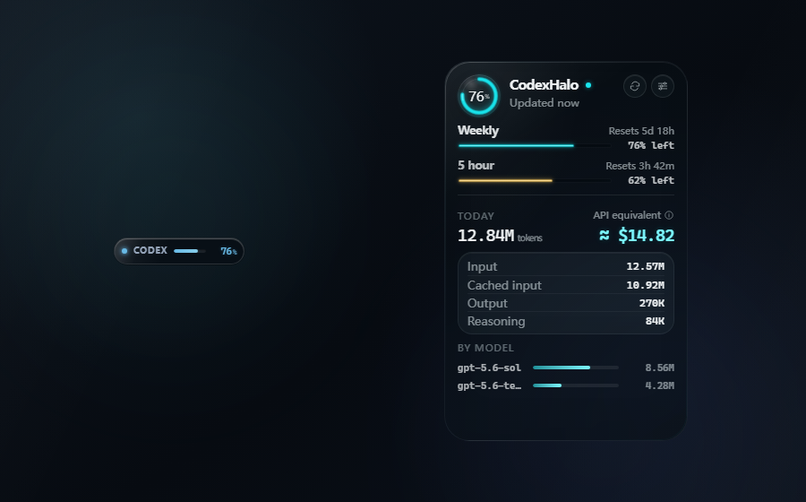

  
  <h1>CodexHalo</h1>
  
A quiet, floating view of your Codex limits and local token usage.

  

    <a href="https://github.com/Mike-Animal-Counseling/CodexHalo/releases/download/v1.0.0/CodexHalo_1.0.0_x64-setup.exe"><strong>Download</strong></a>
  

   
  

## At a glance

- See your 5-hour and weekly limits.
- Review today's tokens and model usage.
- Drag it anywhere, snap it to an edge, or restore it from the tray.

## Install

Download the installer, run it, then enable Codex access when you are ready.

> Windows x64 only. v1.0.0 is unsigned, so SmartScreen may show a warning.

Verify the download

<pre>CodexHalo_1.0.0_x64-setup.exe
SHA-256: 27A35F79FAC9E0B938E6669D0039E87D9D36CE8A8A81D2A86AE59572EBC903F5</pre>

## Private by default

Codex access is off until you enable it. CodexHalo processes supported usage
data locally, sends no telemetry, and never reads browser cookies, passwords,
terminal history, or unrelated workspaces.

Compatibility and build from source

CodexHalo supports 64-bit Windows 10 and Windows 11, the official Codex CLI,
and Codex clients that use the same local session infrastructure. WebView2 is
required and is included with most current Windows installations.

~~~powershell
npm ci
npm test
npm run build
cargo test --workspace --locked
npm run release:windows
~~~

CodexHalo is an independent community utility, not an official OpenAI product.
Released under the [MIT License](LICENSE).
