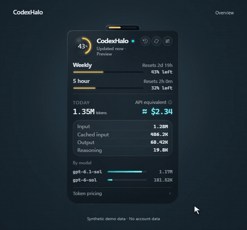

<div align="center">
  
  <h1>CodexHalo</h1>
  <p>让 Codex 额度，安静地留在视线里。</p>
  <p>
    <a href="https://github.com/Mike-Animal-Counseling/CodexHalo/releases/latest"><strong>下载 Windows 版</strong></a>
    &nbsp;·&nbsp; <a href="#news">更新记录</a>
    &nbsp;·&nbsp; <a href="CONTRIBUTING.md">参与贡献</a>
    &nbsp;·&nbsp; <a href="README.md">English</a>
  </p>
  
  <p><a href="https://github.com/Mike-Animal-Counseling/CodexHalo/releases/download/v1.1.1/CodexHalo-demo.mp4">观看演示视频</a> · 演示使用合成数据。</p>
</div>

[](https://github.com/Mike-Animal-Counseling/CodexHalo/actions/workflows/ci.yml)

CodexHalo 是轻量的 Windows Codex 用量工具。圆形浮窗显示剩余额度，点击查看今日用量，再通过 History 按钮查看历史趋势。项目使用 Tauri 2、React、TypeScript 和 Rust。

## News

- **2026-10-07 · [v1.1.1](https://github.com/Mike-Animal-Counseling/CodexHalo/releases/tag/v1.1.1)** History 与价格明细独立成页；设置按组切换，较长列表改为翻页，避免长滚动面板。新增演示、双语文档、贡献指南、问题模板与 CI。
- **2026-10-06 · [v1.1.0](https://github.com/Mike-Animal-Counseling/CodexHalo/releases/tag/v1.1.0)** 改善屏幕边缘隐藏与展开；新增 7 天、30 天和年度趋势、自定义额度重置提醒、可独立更新的模型价格表与分模型估算。
- **2026-08-29 · [v1.0.0](https://github.com/Mike-Animal-Counseling/CodexHalo/releases/tag/v1.0.0)** 首个 Windows 版本：悬浮额度监控、本地今日 Token 用量与 API 等价估算。

查看[完整 Changelog](CHANGELOG.md)或[全部发布版本](https://github.com/Mike-Animal-Counseling/CodexHalo/releases)。在 GitHub 选择 **Watch → Custom → Releases**，可以订阅新版本。

## 功能

- **额度与重置时间**：展示 Codex 返回的额度窗口，常见的是 5 小时和每周额度。
- **今日用量与独立历史页**：查看输入、缓存输入、输出及分模型用量；History 提供 7 天、30 天和年度图表，支持键盘操作。
- **短页面**：History 和价格有独立入口；设置分为 General、Reminders、Prices。较多额度或模型使用翻页。
- **重置提醒**：自定义提前多少分钟提醒，0 表示在重置时提醒。应用运行期间，隐藏浮窗也能提醒。
- **模型价格**：按模型估算 API 等价值，支持每日或手动同步价格表、本地缓存与离线回退；未知模型不编造价格。
- **桌面控制**：拖到屏幕边缘自动隐藏，通过托盘或 **Ctrl + Shift + H** 恢复，支持浅色、深色和跟随系统。

支持已安装的官方 Codex CLI 或 VS Code 扩展。CodexHalo 不会替你安装 Codex。当前发布的桌面版本支持 **Windows 10/11，x64**。

## 安装与升级

1. 从[最新发布页](https://github.com/Mike-Animal-Counseling/CodexHalo/releases/latest)下载安装包。
2. 如果旧版正在运行，先在系统托盘右键退出 CodexHalo。
3. 运行安装包并打开新版。覆盖安装会保留设置，除非你明确选择删除应用数据。
4. 准备好后开启 **Enable Codex**。若无法连接，先打开或登录已安装的 Codex。

安装包目前未签名，Windows 可能显示 SmartScreen 提示。每次发布提供安装包的 SHA-256 和校验文件。用 PowerShell 检查下载文件：

```powershell
Get-FileHash .\CodexHalo_1.1.1_x64-setup.exe -Algorithm SHA256
```

与 [v1.1.1 的 SHA256SUMS.txt](https://github.com/Mike-Animal-Counseling/CodexHalo/releases/download/v1.1.1/SHA256SUMS.txt) 比较。应用升级通过 GitHub Releases 下载并安装，目前没有自动更新程序本体的功能。

## 快速体验

- 点击圆形浮窗进入总览，再点击 **History** 图标，切换 **7d / 30d / 1y**；用返回按钮回到总览。
- 点击 **Token pricing** 查看模型单价和估算值。
- 在 **Settings → General** 选择 **Edge auto-hide**，将浮窗拖到屏幕边缘，悬停在小把手上即可展开。
- 在 **Settings → Reminders** 开启 **Notify before reset**，设置提前时间，点击 **Send test reminder** 测试。通知需要安装后的应用；Windows 设置决定实际送达。
- 在 **Settings → Prices** 选择每日同步，或点击 **Check for price updates** 立即检查。

## 价格如何更新

价格表位于 [data/pricing.json](data/pricing.json)，独立于安装包。维护者审核并发布到仓库 main 分支后，已安装的应用会在下一次每日检查时获取，也可以手动立即检查。**只更新价格，不需要重新安装应用。**

仓库的每日检查从 OpenAI 官方文档生成候选价格表，供维护者审核；它不会自动发布到用户。当前还不是官网价格变化后的实时同步。

估算采用公开的 Standard API Token 价格，仅供参考，不是订阅账单。历史估算使用当前价格表。完整计算规则和维护步骤见[价格文档](docs/pricing.md)。

## 隐私

Codex 数据访问默认关闭，开启后才会在本机解析会话文件。CodexHalo 不上传提示词、账号凭据或用量，也没有遥测。关闭访问会清空内存用量缓存，并阻止较早的读取结果继续更新界面。

价格检查只下载公开 JSON，不发送 Codex 数据。官方 Codex 进程自行处理登录与额度请求。详见[安全与隐私说明](docs/security.md)，或按[安全政策](SECURITY.md)私密报告漏洞。

## 从源码运行

原生桌面开发使用 Windows，准备 Node.js **22.12+**（推荐 22 LTS）、稳定版 Rust、Microsoft C++ Build Tools 和 WebView2。完整说明见 [CONTRIBUTING.md](CONTRIBUTING.md)。

```powershell
git clone https://github.com/Mike-Animal-Counseling/CodexHalo.git
cd CodexHalo
npm ci
npm run tauri -- dev
```

`npm run dev` 只启动使用合成数据的浏览器预览。`npm run release:windows` 构建带隐私检查的 Windows 安装包。

## 项目文档与参与方式

| 文档 | 内容 |
| --- | --- |
| [贡献指南](CONTRIBUTING.md) | 环境、测试与 Pull Request |
| [Changelog](CHANGELOG.md) | 完整版本记录与尚未发布的改动 |
| [发布清单](docs/releasing.md) | 版本号、演示、校验与发布步骤 |
| [架构](docs/architecture.md) | 桌面端与前端边界、Codex 集成 |
| [数据模型](docs/data-model.md) | Token 聚合、历史与估算 |
| [价格](docs/pricing.md) | 单价、假设与价格表维护 |
| [安全政策](SECURITY.md) | 支持版本与私密漏洞报告 |
| [安全与隐私](docs/security.md) | 授权、本地数据与网络行为 |

通过 [Issue 模板](https://github.com/Mike-Animal-Counseling/CodexHalo/issues/new/choose)报告问题或提出功能建议。分享截图与日志前请去除个人信息。参与项目请遵守[行为准则](CODE_OF_CONDUCT.md)。

## 许可证

项目采用 [MIT License](LICENSE)，依赖说明见 [THIRD_PARTY_NOTICES.md](THIRD_PARTY_NOTICES.md)。CodexHalo 是独立的社区工具，并非 OpenAI 官方产品。
